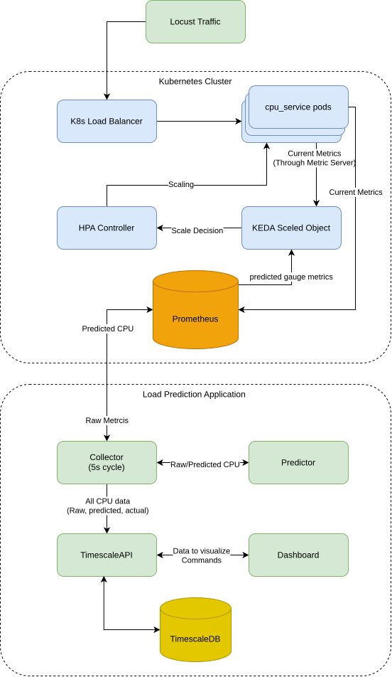

# LPA — Load Prediction Application

Predictive autoscaler for Kubernetes. A GRU neural network forecasts CPU utilization **60 seconds ahead**, exposes the prediction as a Prometheus metric, and KEDA uses it to scale pods *before* a traffic spike arrives — instead of reacting after CPU is already saturated.

---

## System Architecture



---

## How It Works

```
Prometheus (K8s)
      │  every 5s: CPU utilization [0,1], RPS
      ▼
  Collector ──────────────────────────────────────────────────────────────────┐
      │                                                                        │
      │  buffer last 11 points → POST /predict                                │
      ▼                                                                        │
  GRU Predictor                                                               │
      │  4 features → GRU(64) → predicted_cpu_util (+60s)                     │
      ▼                                                                        │
  Prometheus Gauge                  TimescaleDB ◄──────────────────────────────┘
  gru_predicted_cpu_util            (lpa_metrics)
      │
      ▼
  KEDA ScaledObject  ──►  K8s HPA  ──►  scale cpu-service
  (proactive trigger)     (reactive fallback)
```

**Key idea:** With a 60s prediction horizon and a ~15s pod startup time, the new pod is *ready* when the spike actually hits.

---

## Services

| Service | Port | Description |
|---------|------|-------------|
| `timescale_api` | **5000** | Central REST API — metric storage, model registry, settings |
| `predictor` | **6000** | GRU inference service with hot-swap model loading |
| `collector` | **8001** | Async worker — polls Prometheus every 5s, fills prediction buffer, exposes Prometheus gauge |
| `dashboard` | **8501** | Streamlit UI — metrics charts, model registry, upload, settings, logs |
| `timescaledb` | **5432** | PostgreSQL + TimescaleDB |
| `pgadmin` | **5050** | Database administration UI |
| `loki` | **3100** | Log aggregation |
| `promtail` | — | Log shipper (Docker logs → Loki) |
| `grafana` | **3000** | Observability dashboard |

---

## Quick Start

### Prerequisites

- Docker ≥ 24 and Docker Compose v2
- A running Prometheus instance accessible from the Docker host
- Kubernetes cluster with KEDA installed (for autoscaling)

```bash
git clone <repo-url>
cd diploma
docker compose up -d --build
```

Wait ~30s for health checks, then open:

| URL | What |
|-----|------|
| http://localhost:8501 | Streamlit Dashboard |
| http://localhost:5000/docs | TimescaleAPI Swagger |
| http://localhost:6000/docs | GRU Predictor Swagger |
| http://localhost:3000 | Grafana (admin / admin) |
| http://localhost:5050 | pgAdmin (admin@example.com / admin) |
| http://localhost:8001/metrics | Collector Prometheus exporter |

### First-run configuration

1. Open Dashboard → **⚙️ Settings**
2. Set **Prometheus URL** (e.g. `http://host.docker.internal:9090/api/v1/query`)
3. Set PromQL queries for CPU, RAM and RPS
4. Enable **Collector Active** → **Save**

The collector starts gathering metrics within 5 seconds. Predictions begin after 11 points accumulate (~55s).

---

## Data Flow (5-second cycle)

```
1. Fetch CPU utilization [0,1] and RPS from Prometheus
2. Save raw CPU reading (for later actual_cpu sync)
3. Sync actual_cpu for past predictions where target_ts ≈ now
4. Append {cpu_util, rps} to circular buffer (maxlen = 51)
5. When buffer has ≥ MODEL_INPUT_STEPS + 1 = 11 points:
     a. Build 4 features: pct_change(cpu), pct_change(rps), cpu_level, log1p(rps)
     b. POST /predict → GRU → predicted_cpu_util ∈ [0, 1]
     c. Set Prometheus gauge: gru_predicted_cpu_util
     d. POST /metrics/predict → save row to DB
6. KEDA polls: max(gru_predicted_cpu_util) * 100 * replicas_ready → threshold 50
```

---

## GRU Model

| Parameter | Value | Description |
|-----------|-------|-------------|
| Architecture | GRU(64) + Dropout(0.35) + Dense(1, sigmoid) | ~13K parameters |
| Features | pct_change(cpu), pct_change(rps), cpu_level, log1p(rps) | 4 features, hardware-agnostic |
| Input | 10 steps × 4 features (50s window) | scale-invariant velocity + level |
| Output | cpu_util[t+12] point prediction ∈ [0, 1] | 60s ahead (sigmoid, no scaler_y) |
| Loss | Quantile loss (q=0.75) | bias toward over-provisioning |

### Training workflow

```
1. Run Locust against cpu-service with 1 fixed replica, NO HPA
   (test_deployment/locusts/locustfile_training.py)
   → collect clean RPS→CPU data via Collector → export from DB
2. Train in notebooks/final_model_training.ipynb
   → produces: model.keras + scaler_X.joblib (no scaler_y needed)
3. Upload via Dashboard → Upload Model (multipart: .keras + .joblib)
4. Activate via Dashboard → Model Registry → Activate
   → triggers hot-swap in GRU Predictor (zero downtime)
```

---

## KEDA Integration

```yaml
# test_deployment/predictive_hpa.yaml
triggers:
  - type: prometheus          # PROACTIVE — ML prediction
    metricType: AverageValue
    query: max(gru_predicted_cpu_util) * 100 * scalar(kube_deployment_status_replicas_ready{...})
    threshold: '50'           # scale when prediction exceeds 50% CPU

  - type: cpu                 # REACTIVE — fallback (vanilla HPA behaviour)
    metricType: AverageValue
    value: "500"              # 500m per pod (50% of 1000m limit)
```

The dual-trigger design ensures the system **cannot perform worse than vanilla HPA**.

---

## API Reference

### TimescaleAPI (`localhost:5000`)

| Method | Path | Description |
|--------|------|-------------|
| `GET` | `/metrics/history` | Fetch recent prediction records |
| `GET` | `/metrics/history/range` | Fetch records in time range (for fine-tuning) |
| `POST` | `/metrics/predict` | Save a new prediction record |
| `PUT` | `/metrics/{id}/actual` | Sync actual_cpu for a past prediction |
| `GET` | `/models` | List all registered models |
| `POST` | `/models` | Register a new model |
| `GET` | `/models/active` | Get currently active model (used by predictor on cold start) |
| `PUT` | `/models/{version}/activate` | Activate + trigger hot-swap |
| `POST` | `/models/upload` | Upload `.keras` + `.joblib` scaler (multipart) |
| `POST` | `/models/{version}/evaluate` | Calculate real MSE/MAE from DB |
| `GET` | `/settings` | Fetch system settings |
| `PUT` | `/settings` | Update Prometheus URL, PromQL queries, collector toggle |

### GRU Predictor (`localhost:6000`)

| Method | Path | Description |
|--------|------|-------------|
| `POST` | `/predict` | Run inference; body: `{"history": [{cpu, rps} × 9]}` |
| `POST` | `/reload` | Hot-swap model (no restart); body: `{version, model_path, scaler_x_path, window_size, forecast_horizon}` |
| `POST` | `/retrain` | Start background fine-tuning |
| `GET` | `/status` | Current model version and status |

---

## Configuration

### Environment Variables

| Variable | Default | Description |
|----------|---------|-------------|
| `API_URL` | `http://timescale_api:5000` | TimescaleAPI base URL |
| `PREDICTOR_URL` | `http://predictor:6000` | GRU Predictor base URL |
| `MODELS_DIR` | `/app/predictor/ml_models` | Model files directory |
| `SCALERS_DIR` | `/app/predictor/scalers` | Scaler files directory |
| `MODEL_INPUT_STEPS` | `10` | History window size (steps × 5s = 50s context) |
| `MODEL_FEATURES` | `4` | Number of input features (pct_cpu, pct_rps, cpu_level, rps_level) |

All variables are defined in [app/config.py](app/config.py) and can be overridden via Docker environment.

---

## Notebooks

| Notebook | Description |
|----------|-------------|
| [eda_final.ipynb](notebooks/eda_final.ipynb) | Exploratory data analysis: ACF/PACF, cross-correlation between RPS and CPU, feature correlation, ADF stationarity tests. Produces figures for Chapter 4 of the thesis. |
| [hyperparam_search.ipynb](notebooks/hyperparam_search.ipynb) | Walk-forward cross-validation over window size, forecast horizon, and feature set combinations. Selects w=10, H=12, 4-feature configuration by CV loss. Produces the hyperparameter search heatmap. |
| [final_model_training.ipynb](notebooks/final_model_training.ipynb) | Trains the production GRU model on the full training set. Exports `model.keras` and `scaler_X.joblib`. Produces learning curves and inference simulation figures. |
| [export_prometheus_to_csv.ipynb](notebooks/export_prometheus_to_csv.ipynb) | Exports raw Prometheus time-series (CPU util, GRU prediction, replica count) from the TSDB backup to per-scenario CSV files in `notebooks/prometheus_export/`. Run this before the experiment analysis notebooks. |
| [experiment_results_single_run.ipynb](notebooks/experiment_results_single_run.ipynb) | Analyses one A/B run (mw2_3): per-scenario replica/CPU timelines, scale-up lag, latency boxplots, overprovisioning. Produces `final_*.png` figures used in Chapter 5. |
| [experiment_statistical.ipynb](notebooks/experiment_statistical.ipynb) | Aggregates all three A/B runs (mw2_2, mw2_3, mw2_4). Runs Wilcoxon signed-rank tests on 18 paired observations. Produces `stat_*.png` figures and the final statistical tables. |

---

## Datasets

Located in [notebooks/raw_data/](notebooks/raw_data/). Both files are TimescaleDB exports from the Collector, recorded with one fixed replica and no HPA active (clean RPS→CPU signal).

| File | Rows | Size | Role |
|------|------|------|------|
| `data-1774627968260.csv` | 2022 | 354 KB | **Training set** (larger) |
| `data-1774610506409.csv` | 553 | 93 KB | **Validation set** (smaller) |

Columns: `ts` (timestamp), `input_cpu` (raw CPU cores), `input_rps` (requests/s).  
CPU is normalised to utilization ∈ [0, 1] by dividing by `CPU_LIMIT = 2.0` during loading.

The experiment data (Locust CSVs and Prometheus per-scenario exports) is in [test_deployment/locusts/results/](test_deployment/locusts/results/) and [notebooks/prometheus_export/](notebooks/prometheus_export/).

---

## Load Testing & A/B Experiment

### Target service

[test_deployment/cpu_service/](test_deployment/cpu_service/) — FastAPI service that runs bcrypt hashing in a `ThreadPoolExecutor`.  
`MAX_WORKERS=2` creates a hard concurrency limit per pod: saturation at ~5 RPS/pod makes the difference between 1 and 2 ready replicas clearly visible in tail latency.

### Kubernetes manifests

| File | Description |
|------|-------------|
| [cpu-service.yaml](test_deployment/cpu-service.yaml) | K8s Deployment + Service for the target workload |
| [predictive_hpa.yaml](test_deployment/predictive_hpa.yaml) | KEDA ScaledObject — dual trigger (GRU prediction + CPU fallback); Round B |
| [vanilla_hpa.yaml](test_deployment/vanilla_hpa.yaml) | Standard HPA — reactive CPU baseline; Round A |
| [prometheus-collector-scrape.yaml](test_deployment/prometheus-collector-scrape.yaml) | Prometheus ServiceMonitor to scrape the Collector's `/metrics` endpoint |

### Port-forward helpers

[test_deployment/forwards/](test_deployment/forwards/) — one-liner scripts to expose cluster services locally during experiments:

| Script | What it forwards |
|--------|-----------------|
| `forward_cpu_service.sh` | cpu-service → `localhost:8080` |
| `forward_prometheus.sh` | cluster Prometheus → `localhost:9090` |
| `forward_deployment.sh` | LPA stack ports |

### Locust load test files

| File | Description |
|------|-------------|
| [locustfile_training.py](test_deployment/locusts/locustfile_training.py) | 3 repeats × 5 scenarios in shuffled order (seed 99). Runs without HPA to collect clean training data. Total ~142 min. |
| [locustfile_scenarios.py](test_deployment/locusts/locustfile_scenarios.py) | 6 scenarios in fixed order with 2-min cooldowns. Used for manual single-round runs. Total ~72 min. |
| [locustfile_experiment.py](test_deployment/locusts/locustfile_experiment.py) | Same 6-scenario shape as above. Records exact Unix timestamps for each scenario boundary into `experiment_timestamps.json`. Run once per A/B round with `EXPERIMENT_ROUND=round_a` or `round_b`. |
| `experiment_timestamps.json` | Recorded scenario start/end times; used by `export_prometheus_to_csv.ipynb` for Prometheus range queries. |
| `results/` | Locust CSV output from all three A/B runs: `round_{a,b}_mw2_{2,3,4}_{stats,stats_history,failures,exceptions}.csv` |

### Running an A/B experiment

```bash
# Round A — Vanilla HPA (reactive baseline)
kubectl delete scaledobject --all
kubectl apply -f test_deployment/vanilla_hpa.yaml
EXPERIMENT_ROUND=round_a locust -f test_deployment/locusts/locustfile_experiment.py \
    --host http://localhost:8080 --headless -u 120 -r 5 \
    --csv test_deployment/locusts/results/round_a_mw2_N

# Round B — Predictive KEDA
kubectl delete hpa --all
kubectl apply -f test_deployment/predictive_hpa.yaml
EXPERIMENT_ROUND=round_b locust -f test_deployment/locusts/locustfile_experiment.py \
    --host http://localhost:8080 --headless -u 120 -r 5 \
    --csv test_deployment/locusts/results/round_b_mw2_N
```

After both rounds: run `export_prometheus_to_csv.ipynb`, then `experiment_results_single_run.ipynb` for per-scenario analysis, then `experiment_statistical.ipynb` for cross-run Wilcoxon tests.

---

## Scripts

| Script | Description |
|--------|-------------|
| [scripts/start.sh](scripts/start.sh) | Starts the LPA Docker Compose stack and sets up port-forwards |
| [scripts/end.sh](scripts/end.sh) | Tears down the stack and cleans up port-forwards |

---

## Project Structure

```
diploma/
├── app/
│   ├── config.py                   # Global config: URLs, dirs, MODEL_INPUT_STEPS, MODEL_FEATURES
│   ├── timescale_api/              # Central REST API (FastAPI + SQLAlchemy + TimescaleDB)
│   │   └── api/
│   │       ├── routes/             # metrics.py, model.py, settings.py, logs.py
│   │       ├── models.py           # ORM: MetricEntry, ModelRegistry, SystemSettings, SystemLog
│   │       └── database.py
│   ├── predictor/                  # GRU Predictor microservice (FastAPI, port 6000)
│   │   ├── api/routes.py           # /predict, /reload, /retrain, /status
│   │   └── services/
│   │       ├── model_manager.py    # Thread-safe predict + hot-swap + fine-tune
│   │       └── utils.py            # Fine-tune pipeline, data preparation
│   ├── collector/                  # Metric collection worker (port 8001)
│   │   ├── worker.py               # Main async loop (5s interval)
│   │   └── services/
│   │       ├── prometheus.py       # PromQL fetch
│   │       └── api_client.py       # TimescaleAPI + Predictor client
│   ├── dashboard/
│   │   └── app.py                  # Streamlit (5 pages: Metrics, Registry, Upload, Settings, Logs)
│   ├── shared/
│   │   ├── schemas.py              # All Pydantic models
│   │   ├── utils.py
│   │   └── logger.py
│   ├── ml_models/                  # .keras model files
│   ├── scalers/                    # .joblib scaler files
│   └── Dockerfile
├── notebooks/
│   ├── raw_data/                   # TimescaleDB exports: train (2022 rows) + val (553 rows)
│   ├── prometheus_export/          # Per-scenario Prometheus CSVs (cpu_util, gru_pred, replicas)
│   ├── figures/                    # All generated plots
│   ├── model_config.json           # Active model hyperparameters
│   ├── eda_final.ipynb             # Dataset EDA (ACF/PACF, cross-correlation, stationarity)
│   ├── hyperparam_search.ipynb     # Walk-forward CV: window/horizon/feature search
│   ├── final_model_training.ipynb  # Production model training → model.keras + scaler_X.joblib
│   ├── export_prometheus_to_csv.ipynb   # Export Prometheus TSDB → per-scenario CSVs
│   ├── experiment_results_single_run.ipynb  # Single A/B run analysis (final_*.png)
│   └── experiment_statistical.ipynb         # 3-run Wilcoxon tests (stat_*.png)
├── test_deployment/
│   ├── cpu_service/                # Target workload source (FastAPI + bcrypt + ThreadPoolExecutor)
│   │   ├── main.py                 # /compute endpoint, MAX_WORKERS=2 concurrency limit
│   │   ├── Dockerfile
│   │   └── redeploy.sh             # Rebuild & push to Minikube image registry
│   ├── cpu-service.yaml            # K8s Deployment + Service for cpu-service
│   ├── predictive_hpa.yaml         # KEDA ScaledObject (GRU + CPU dual trigger) — Round B
│   ├── vanilla_hpa.yaml            # Standard HPA baseline — Round A
│   ├── prometheus-collector-scrape.yaml  # ServiceMonitor for Collector metrics
│   ├── forwards/                   # Port-forward helper scripts
│   └── locusts/                    # Locust load test scripts + results
│       ├── locustfile_training.py  # Training data collection (no HPA)
│       ├── locustfile_scenarios.py # 6 scenarios, manual run
│       ├── locustfile_experiment.py # A/B runner with timestamp logging
│       ├── experiment_timestamps.json
│       └── results/                # Locust CSV output (3 runs × 2 rounds)
├── scripts/
│   ├── start.sh                    # Start LPA stack + port-forwards
│   └── end.sh                      # Teardown
├── configs/                        # Loki, Promtail, Grafana provisioning
├── docker-compose.yaml
└── pyproject.toml                  # Black, isort, mypy config
```

---

## Code Quality

```bash
black app/
isort app/
mypy
```

Configuration in [pyproject.toml](pyproject.toml): Black line length 88, mypy checks `app/` only.
